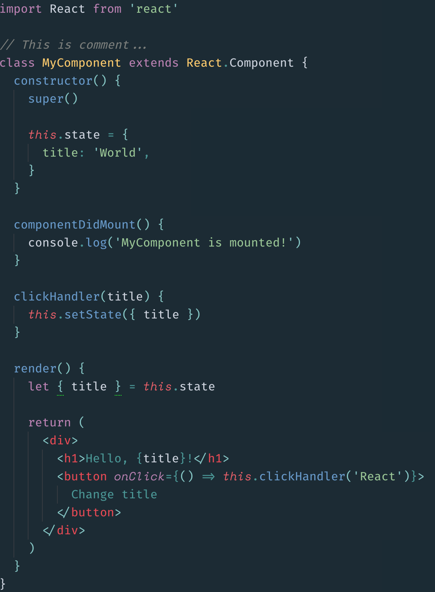
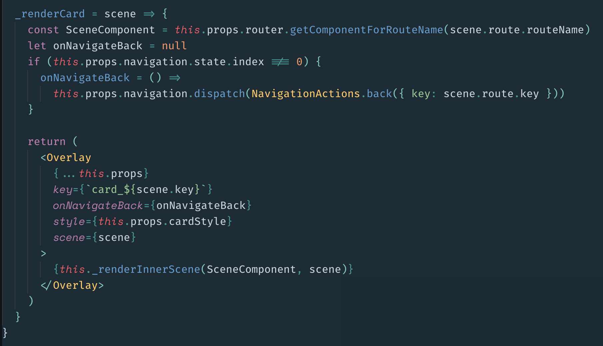

# Operator Mono syntax theme

A syntax theme for Operator Mono and friends based on [Oceanic Next](http://labs.voronianski.com/oceanic-next-color-scheme/)

## For best results...

- For React/JSX development I *highly* recommend [language-babel](https://atom.io/packages/language-babel) otherwise ES2016 and React/JSX code syntax highlighting does not look good.

## Screenshots

Font: Fira code
Alternative font: Space Mono (see [this repo](https://github.com/klippx/operator-mono-atom) how to enable alternative fonts)
